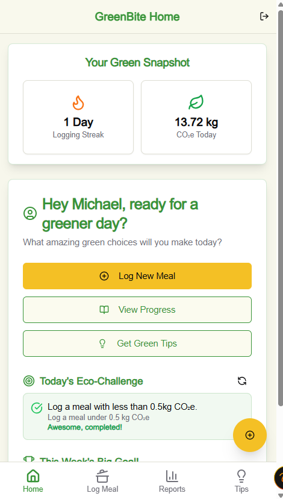
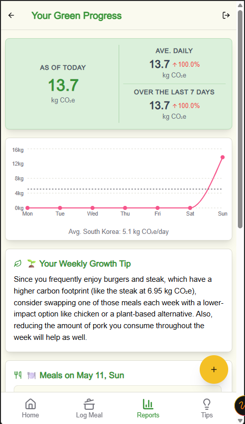
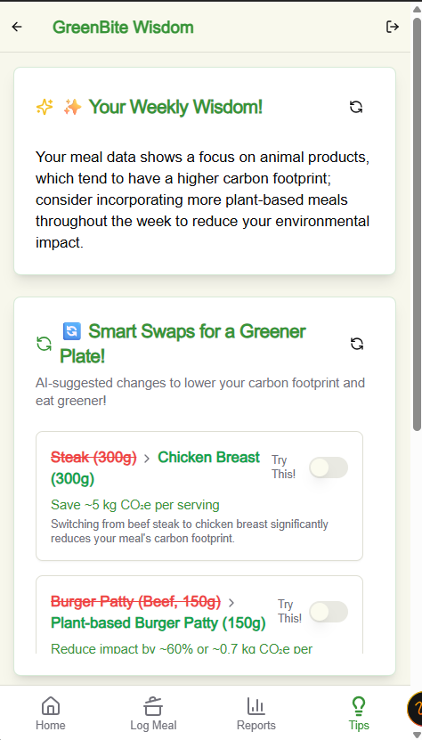
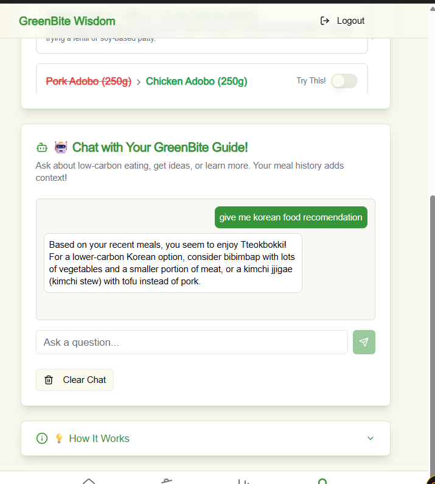

# 🥗 GreenBite: AI-Powered Carbon Footprint Food Tracker

GreenBite is a modern web application that empowers users to understand and reduce the environmental impact of their meals. By leveraging AI for food recognition and carbon estimation, GreenBite makes sustainable eating easy, insightful, and engaging.

---

## 🚀 What It Does

- **Log Meals with AI:** Snap a photo of your meal or enter items manually. The AI identifies food items and estimates quantities.
- **Instant Carbon Footprint:** Get an automatic calculation of your meal's carbon footprint (kg CO₂e) using AI and food databases.
- **Progress Tracking:** Visualize your daily and weekly carbon impact, compare to national averages, and see trends.
- **Personalized Recommendations:** Receive AI-powered eco-friendly tips, food swaps, and sustainability advice.
- **Challenges & Streaks:** Stay motivated with daily/weekly goals, streaks, and achievement feedback.

---

## 🧩 Core Features

### 1. 📷 AI Meal Logging
- Take a photo or enter food items.
- AI detects and estimates food quantities (e.g., "200g beef", "1 cup rice").
- Edit and confirm before saving.
- Instant carbon footprint breakdown and history.

### 2. 📈 Progress & Analytics
- See today's and last 7 days' CO₂e totals.
- 7-day bar graph with national average reference.
- Tap a bar to view detailed food logs for that day.
- AI-generated insights and affirmations.

### 3. 💬 AI Recommendations
- Personalized tips based on your eating patterns.
- Suggested food swaps to lower your carbon impact.
- Built-in AI chatbot for sustainability questions.

### 4. 🏆 Challenges & Streaks
- Daily/weekly goals (e.g., stay under X kg/day).
- Streaks for eco-friendly eating.
- Visual feedback and achievement badges.

### 5. 🌱 Smart Feedback
- AI analyzes each meal for impact.
- High footprint? Get reduction suggestions.
- Low footprint? Receive positive affirmations.
- Real-world equivalency (e.g., "This meal = 4 hours of driving").

---

## 🛠️ Tech Stack

- **Frontend:** Next.js 15, React 18, TypeScript
- **Styling:** Tailwind CSS, Radix UI
- **State Management:** React Context API
- **AI Integration:** Google AI (via GenKit)
- **Authentication:** Firebase
- **Data Visualization:** Recharts
- **Forms & Validation:** React Hook Form, Zod

---

## 🗂️ Project Structure

```
src/
├── ai/              # AI flows: food recognition, carbon estimation, tips, chatbot, etc.
│   └── flows/       # Individual AI-powered features
├── app/             # Next.js app router pages (log-meal, meal-result, reports, etc.)
├── components/      # Reusable UI components (header, nav, cards, etc.)
├── context/         # React context providers (global state, user, meal logs)
├── hooks/           # Custom React hooks
├── lib/             # Utility functions and helpers
└── services/        # API and external service integrations
```

---

## 📱 Main Pages

- `/` – Home/Dashboard: Streaks, today's CO₂e, quick actions, challenges
- `/log-meal` – Log a meal (photo upload, AI detection, manual entry)
- `/meal-result` – See carbon breakdown, feedback, and suggestions
- `/reports` – Progress analytics, 7-day graph, meal logs
- `/recommendations` – Personalized tips, food swaps, chatbot
- `/review-meal` – Edit and confirm meal details
- `/login` – Secure authentication

---

## 🖼️ Screenshots

- **Home/Dashboard:** 
- **Food Identifier:** 
- **Footprint Result:** 
- **Reports:** 
- **Recommendations:** 
- **Chatbot:** 

---

## 🏁 Getting Started

### Prerequisites
- Node.js (LTS)
- npm or yarn
- Firebase project (for authentication)
- Google AI API key (for GenKit)

### Installation

1. **Clone the repository:**
   ```bash
   git clone https://github.com/Norbera0/GreenBite.git
   cd GreenBite
   ```

2. **Install dependencies:**
   ```bash
   npm install
   # or
   yarn install
   ```

3. **Set up environment variables:**
   Create a `.env.local` file in the root:
   ```
   NEXT_PUBLIC_FIREBASE_API_KEY=your_firebase_api_key
   NEXT_PUBLIC_FIREBASE_AUTH_DOMAIN=your_firebase_auth_domain
   NEXT_PUBLIC_FIREBASE_PROJECT_ID=your_firebase_project_id
   NEXT_PUBLIC_FIREBASE_STORAGE_BUCKET=your_firebase_storage_bucket
   NEXT_PUBLIC_FIREBASE_MESSAGING_SENDER_ID=your_firebase_messaging_sender_id
   NEXT_PUBLIC_FIREBASE_APP_ID=your_firebase_app_id
   GOOGLE_AI_API_KEY=your_google_ai_api_key
   ```

4. **Start the development server:**
   ```bash
   npm run dev
   # or
   yarn dev
   ```
   The app will be available at [http://localhost:9002](http://localhost:9002)

---

## 🤝 Contributing

1. Fork the repo
2. Create your feature branch (`git checkout -b feature/AmazingFeature`)
3. Commit your changes (`git commit -m 'Add some AmazingFeature'`)
4. Push to the branch (`git push origin feature/AmazingFeature`)
5. Open a Pull Request

---

## 📝 License

MIT License – see the LICENSE file for details.

---

## 🙏 Acknowledgments

- Next.js, React, Tailwind CSS, Radix UI, Google AI, Firebase, Recharts, GenKit

---
